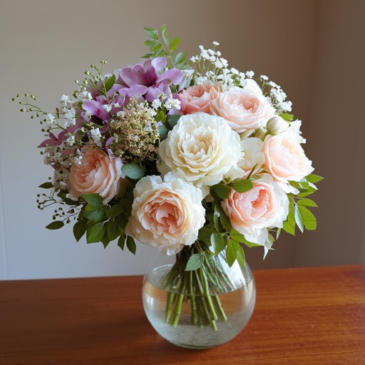
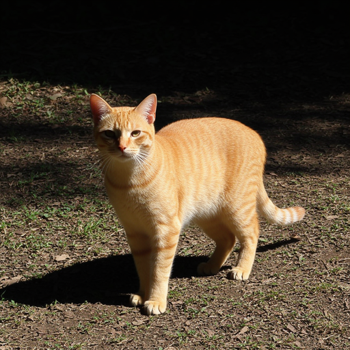
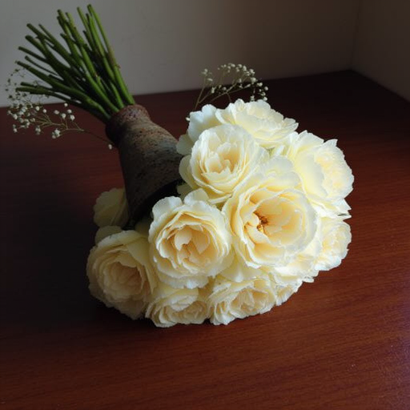
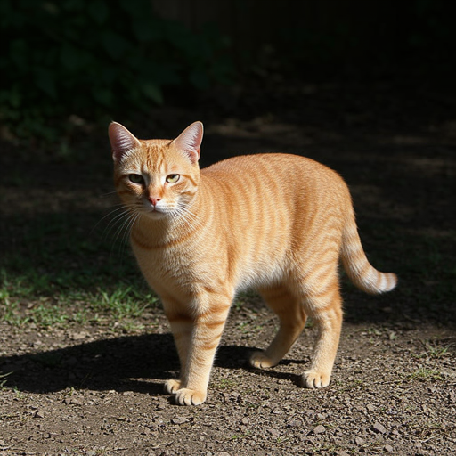

# Отчёт: `experiment_20260522_094739`

**Папка:** `openevolve_sap/experiments/experiment_20260522_094739`  
**Время:** 09:47–10:33 (22.05.2026), ~46 мин  
**Конфиг:** 80 итераций, 4 GPU (0–3), RAM limit ~94 GiB  
**Цель:** эволюция `SYSTEM_PROMPT` для SAP-декомпозиции противоречивых промптов → FLUX → оценка

**Модели в этом прогоне** (до перестановки моделей в коде):

| Роль | Модель |
|------|--------|
| SAP-декомпозиция | `qwen/qwen3.5-35b-a3b` |
| Мутации эволюции | `google/gemini-3.1-pro-preview` |
| Alignment (VL) | `qwen/qwen3-vl-235b-a22b-thinking` |
| Gemma judge | `google/gemma-4-26b-a4b-it` |

**Метрика:** `combined_score = 0.8 × (alignment/5) + 0.2 × (gemma/5)`

---

## Тестовые промпты

1. A bouquet of flowers is upside down in a vase
2. A white glove has 6 fingers
3. The shadow of a cat is facing the opposite direction

---

## Сводка по прогону

| Показатель | Значение |
|------------|----------|
| Полных оценок (3 промпта) | **19** run_id в `eval_results/` |
| Лучший `combined_score` | **0.84** (alignment 4.0, gemma 5.0) |
| Худший `combined_score` | **0.307** (alignment 1.67, gemma 1.0) — 6 прогонов на этом уровне |
| Лучшая программа | `c178c6bf-98bd-45a2-9f8b-e98a2b77d583`, итерация **14**, generation 2 |
| Лучший eval run | `1779434055_59099f62` |
| Худший (базовый) eval run | `1779432465_a69086bb` — первая оценка в логе |

**Динамика:** старт ~0.31 → пик **0.84** на итерации 14 → поздние мутации снова падали до 0.31–0.36. Итог эксперимента зафиксирован на **0.84**.

Сохранённый лучший промпт: `openevolve_sap/output/best/best_program.py`

---

## Худшая модель (базовый SYSTEM_PROMPT)

**Run:** `1779432465_a69086bb` · **combined = 0.307**

Стратегия декомпозиции: сначала «нормальный» букет в вазе, потом переключение на upside down — типичная ошибка для структурных противоречий (модель «залипает» на правильной геометрии).

| # | Промпт | Alignment | Что пошло не так |
|---|--------|-----------|------------------|
| 0 | Букет вверх ногами | 2 | Букет **в вазе**, но **не перевёрнут** |
| 1 | 6 пальцев | 2 | Белая перчатка, но **5 пальцев** |
| 2 | Тень кота | 1 | Обычная тень, не «в противоположную сторону» |

### Декомпозиция (промпт 0, худший)

```json
{
  "prompts_list": [
    "A bouquet of flowers in a vase",
    "A bouquet of flowers is upside down in a vase"
  ],
  "switch_prompts_steps": [3]
}
```

### Картинки (худшая)

**Промпт 0** — букет в вазе, ориентация обычная (alignment: 2):

<p align="center">
  
</p>

**Промпт 1** — 5 пальцев вместо 6 (alignment: 2):

<p align="center">
  
</p>

**Промпт 2** — кошка с обычной тенью (alignment: 1):

<p align="center">
  
</p>

---

## Лучшая модель (эволюционированный SYSTEM_PROMPT)

**Run:** `1779434055_59099f62` · **combined = 0.84**

Ключевое изменение в промпте: для **структурных** противоречий ранняя стадия должна сразу задавать «неправильную» геометрию (прокси: `hand with 6 fingers`, `upside down broom`), а не нормальный объект.

### Декомпозиция (промпт 1, лучший)

```json
{
  "prompts_list": [
    "A hand with 6 fingers",
    "A white glove with 6 fingers"
  ],
  "switch_prompts_steps": [4]
}
```

| # | Промпт | Alignment | Результат |
|---|--------|-----------|-----------|
| 0 | Букет вверх ногами | **2** | Красивый букет, но **без вазы** и не перевёрнут — слабое место |
| 1 | 6 пальцев | **5** | Белая перчатка с **6 пальцами** |
| 2 | Тень кота | **5** | Кот и тень в **противоположных** направлениях |

### Картинки (лучшая)

**Промпт 0** — букет без вазы / не upside down (alignment: 2):

<p align="center">
  
</p>

**Промпт 1** — 6 пальцев (alignment: 5):

<p align="center">
  
</p>

**Промпт 2** — тень в противоположную сторону (alignment: 5):

<p align="center">
  
</p>

---

## Сравнение худшего vs лучшего

| Промпт | Худший align | Лучший align | Δ |
|--------|--------------|--------------|---|
| Букет | 2 | 2 | 0 |
| Перчатка | 2 | **5** | +3 |
| Кот / тень | 1 | **5** | +4 |

Эволюция дала **+0.53** к `combined_score` в основном за счёт перчатки и кота; букет остался «красивым, но не по ТЗ».

### Визуальное сравнение по промптам

#### Промпт 1: «A white glove has 6 fingers»

| Худший (align 2) | Лучший (align 5) |
|------------------|------------------|
|  |  |

#### Промпт 2: «The shadow of a cat is facing the opposite direction»

| Худший (align 1) | Лучший (align 5) |
|------------------|------------------|
|  |  |

#### Промпт 0: «A bouquet of flowers is upside down in a vase»

| Худший (align 2) | Лучший (align 2) |
|------------------|------------------|
|  |  |

---

## Сравнение по времени: подход 1 vs подход 2

**Подход 1** — сначала «нормальный» объект, потом переключение на противоречие  
*(пример: `bouquet in a vase` → `upside down`; `white glove` → `6 fingers`)*  

**Подход 2** — ранняя геометрия/прокси с противоречием уже на шаге 0  
*(пример: `vase held upside down`; `hand with 6 fingers`; тень в финальном промпте с шага 2)*  

Источник таймингов: `status.jsonl` (unix timestamp между событиями).

### Одна полная оценка (3 промпта, 1 GPU-воркер)

| | Подход 1 (худший run) | Подход 2 (лучший run) | Δ |
|--|----------------------|----------------------|---|
| **Run ID** | `1779432465_a69086bb` | `1779434055_59099f62` | — |
| **combined** | 0.307 | 0.840 | +0.53 |
| **Всего eval** | **4.6 мин** (276 с) | **6.9 мин** (412 с) | **+49%** |

### Разбивка по этапам (секунды на промпт)

| Промпт | Этап | Подход 1 | Подход 2 | Δ |
|--------|------|----------|----------|---|
| 0 — букет | SAP (LLM декомпозиция) | 48.0 | 46.7 | ≈0 |
| 0 — букет | FLUX (генерация) | 34.9 | 33.0 | ≈0 |
| 0 — букет | Оценка (VL + judges) | 11.6 | 38.9 | +27 с |
| 0 — букет | **Итого** | **94.5** | **118.6** | +24 с |
| 1 — перчатка | SAP | 28.4 | 48.9 | +21 с |
| 1 — перчатка | FLUX | 28.9 | 32.8 | ≈0 |
| 1 — перчатка | Оценка | 20.6 | 23.7 | ≈0 |
| 1 — перчатка | **Итого** | **77.9** | **105.4** | +28 с |
| 2 — кот / тень | SAP | 52.7 | 59.4 | +7 с |
| 2 — кот / тень | FLUX | 28.7 | 30.1 | ≈0 |
| 2 — кот / тень | Оценка | 20.5 | **81.0** | +61 с |
| 2 — кот / тень | **Итого** | **101.9** | **170.5** | +69 с |

### Средние по всем run эксперимента (эвристика по первому sub-prompt)

| Этап | Подход 1 (n≈54 промптов) | Подход 2 (n≈9) |
|------|--------------------------|----------------|
| SAP | 63.1 с (med 59.2) | 67.5 с (med 52.0) |
| FLUX | **32.5 с** (med 33.2) | **30.6 с** (med 30.4) |
| Оценка | 31.9 с (med 25.9) | 30.1 с (med 27.6) |
| **На 1 промпт** | **127.5 с** (med 124) | **128.2 с** (med 119) |
| Средний alignment | 2.5 | 2.8 |

### Выводы по времени

1. **FLUX не тормозит подход 2** — ~30–35 с на картинку в обоих подходах (2 sub-prompt, 30 шагов).
2. **Подход 2 на лучшем run дольше на +2.3 мин**, в основном из‑за **разброса API оценки** (промпт 2: 81 с vs 20 с), а не из‑за другой стратегии SAP.
3. **SAP (RouterAI)** — сопоставимо (~47–60 с на промпт); у подхода 2 иногда длиннее из‑за более длинных sub-prompt, не из‑за числа шагов (часто тоже 2).
4. **По качеству подход 2 выигрывает** на перчатке и коте при **сопоставимом** wall-clock на уровне всего эксперимента (медиана ~2 мин/промпт).
5. Полный эксперимент эволюции: **~46 мин** (09:47–10:33), 19 полных eval при 4 параллельных GPU.

---

## Прогресс по оценкам (из лога)

| combined | alignment | gemma | Примечание |
|----------|-----------|-------|------------|
| 0.307 | 1.67 | 1.0 | Старт / несколько откатов |
| 0.520 | 3.0 | 1.0 | Первый подъём alignment |
| 0.733 | 3.33 | 5.0 | Gemma впервые 5 |
| **0.840** | **4.0** | **5.0** | **Пик (iter 14)** |
| 0.307 | 1.67 | 1.0 | Поздние регрессии |

---

## Выводы

1. **Эволюция сработала** для пространственных/анатомических противоречий (6 пальцев, направление тени) после смены стратегии «не начинать с нормального объекта».
2. **Букет — bottleneck:** даже лучший промпт не стабильно даёт «upside down in a vase»; alignment 2 на обоих крайних run.
3. **Gemma judge** поднялся с 1.0 до 5.0 на лучших кандидатах — системный промпт стал лучше объяснять стратегию декомпозиции.
4. Артефакты: `openevolve_sap/experiments/experiment_20260522_094739/eval_results/<run_id>/prompt_XX/`.

---

## Пути к артефактам

| Run | combined | Путь |
|-----|----------|------|
| Худший | 0.307 | `openevolve_sap/experiments/experiment_20260522_094739/eval_results/1779432465_a69086bb/` |
| Лучший | 0.840 | `openevolve_sap/experiments/experiment_20260522_094739/eval_results/1779434055_59099f62/` |
