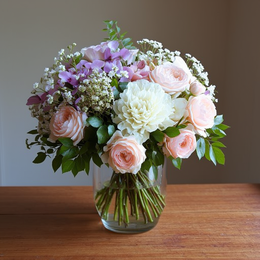
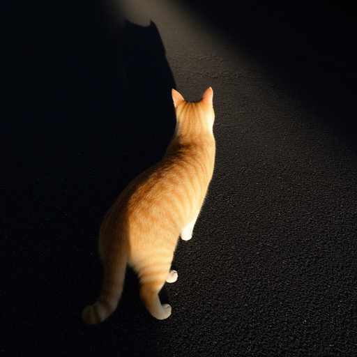
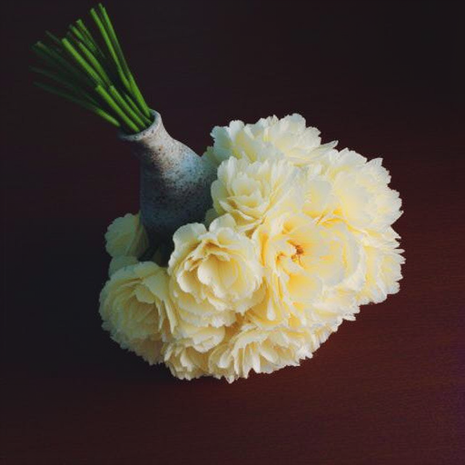
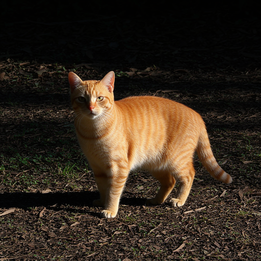
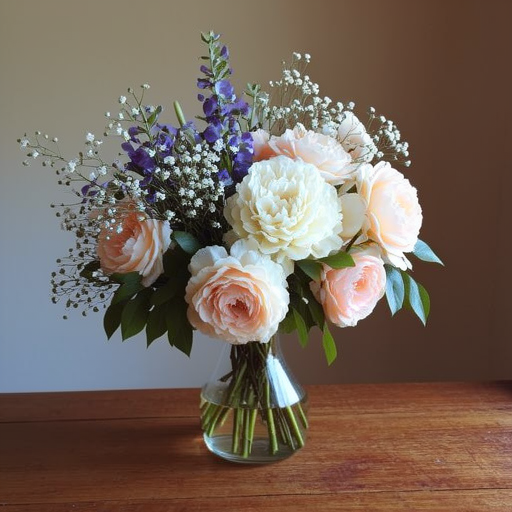
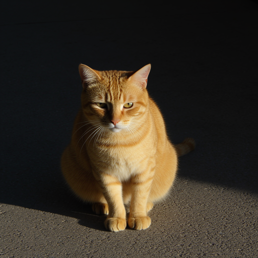

# Отчёт: `experiment_20260522_125709`

**Папка:** `openevolve_sap/experiments/experiment_20260522_125709`  
**Время:** 12:57–13:46 (22.05.2026), ~49 мин  
**Конфиг:** 100 итераций, 4 GPU (0–3), RAM limit ~94 GiB, checkpoint каждые 50 итераций  
**Цель:** эволюция `SYSTEM_PROMPT` для SAP-декомпозиции противоречивых промптов → FLUX → оценка  
**Отличие от `experiment_20260522_094739`:** полный meta-prompt `evolution_system_message.md`, 100 итераций вместо 80

**Модели:**

| Роль | Модель |
|------|--------|
| SAP-декомпозиция | `qwen/qwen3.5-35b-a3b` |
| Мутации эволюции | `google/gemini-3.1-pro-preview` |
| Alignment (VL) | `qwen/qwen3-vl-235b-a22b-thinking` |
| Prompt-quality judge (`gemma_score`) | `google/gemini-3.1-pro-preview` |

**Метрика:** `combined_score = 0.8 × (alignment/5) + 0.2 × (gemma/5)`

---

## Тестовые промпты

1. A bouquet of flowers is upside down in a vase
2. A white glove has 6 fingers
3. The shadow of a cat is facing the opposite direction

---

## Сводка по прогону

| Показатель | Значение |
|------------|----------|
| Полных оценок (3 промпта) | **25** manifest в `eval_results/` (29 папок run_id) |
| Лучший `combined_score` | **0.84** (alignment 4.0, gemma 5.0) |
| Худший `combined_score` | **0.253** (alignment 1.33, gemma 1.0) — 3 прогона |
| Лучшая программа | `560d64dd-4e3c-456c-9dec-026727867994`, итерация **4**, generation 1 |
| Лучший eval run | `1779444403_30c6f13b` |
| Первая оценка (базовый промпт) | `1779443842_27c1ed46`, combined **0.467** |
| Средний combined (итог CSV) | **0.550** по 25 программам |
| Checkpoint | `openevolve_sap/output/checkpoints/checkpoint_100` |

**Динамика:** первая оценка 0.467 → пик **0.84** на итерации 4 (~15 мин от старта) → далее колебания 0.52–0.73 и регрессии до **0.253**. Итог эксперимента зафиксирован на **0.84** (лучший не был превзойдён до iter 100).

Сохранённый лучший промпт: `openevolve_sap/output/best/best_program.py`

---

## Сравнение с предыдущим экспериментом (`094739`)

| | `094739` | `125709` (этот) |
|--|----------|-----------------|
| Итерации | 80 | 100 |
| Полных eval | 19 | 25 |
| Пик combined | 0.84 | 0.84 |
| Итерация пика | 14 | **4** |
| Букет (лучший align) | 2 | **5** |
| Перчатка (лучший align) | **5** | 2 |
| Кот / тень (лучший align) | 5 | 5 |
| Wall-clock | ~46 мин | ~49 мин |

Эволюция с meta-prompt **быстрее нашла 0.84**, но **перераспределила** успех: впервые стабильно решён букет (upside down in vase), зато перчатка на лучшем run снова 5 пальцев.

---

## Первая оценка — базовый SYSTEM_PROMPT (подход 1)

**Run:** `1779443842_27c1ed46` · **combined = 0.467**

Стратегия: «нормальный» объект сначала, противоречие позже (ваза с цветами → переворот; белая перчатка → 6 пальцев).

| # | Промпт | Alignment | Что пошло не так |
|---|--------|-----------|------------------|
| 0 | Букет вверх ногами | 2 | Ваза и цветы есть, переворот слабый |
| 1 | 6 пальцев | 2 | Перчатка, но **5 пальцев** |
| 2 | Тень кота | 1 | Тень не в противоположную сторону |

### Декомпозиция (промпт 0, первая оценка)

```json
{
  "prompts_list": [
    "A vase with flowers on a surface",
    "A vase with flowers inverted downwards",
    "A bouquet of flowers is upside down in a vase"
  ],
  "switch_prompts_steps": [4, 8]
}
```

### Картинки (первая оценка)

<p align="center">
  
</p>

<p align="center">
  
</p>

<p align="center">
  
</p>

---

## Лучшая модель (эволюционированный SYSTEM_PROMPT)

**Run:** `1779444403_30c6f13b` · **combined = 0.84**  
**Program:** `560d64dd-4e3c-456c-9dec-026727867994` · **iteration 4**

Ключевое изменение: **Strategy B** — ранняя геометрия с противоречием (`An upside-down vase`, `A hand with 6 fingers`), без «нормального» объекта на шаге 0.

### Декомпозиция (промпт 0 — букет, лучший)

```json
{
  "prompts_list": [
    "An upside-down vase",
    "Flowers in an upside-down vase",
    "A bouquet of flowers upside down in a vase"
  ],
  "switch_prompts_steps": [3, 6]
}
```

### Декомпозиция (промпт 1 — перчатка)

```json
{
  "prompts_list": [
    "A hand with 6 fingers",
    "A white glove with 6 fingers"
  ],
  "switch_prompts_steps": [4]
}
```

| # | Промпт | Alignment | Результат |
|---|--------|-----------|-----------|
| 0 | Букет вверх ногами | **5** | Цветы **ниже** вазы, стебли вверх — переворот выполнен |
| 1 | 6 пальцев | 2 | Белая перчатка, но **5 пальцев** — слабое место |
| 2 | Тень кота | **5** | Кот и тень в **противоположных** направлениях |

### Картинки (лучшая)

**Промпт 0** — upside down in vase (alignment: 5):

<p align="center">
  
</p>

**Промпт 1** — 5 пальцев вместо 6 (alignment: 2):

<p align="center">
  
</p>

**Промпт 2** — тень в противоположную сторону (alignment: 5):

<p align="center">
  
</p>

---

## Худшая оценка (регрессия)

**Run:** `1779446205_7af30cfd` · **combined = 0.253** (также 0.253 у `1779445120_6bfbba06`, `1779445159_f6c55058`)

На paper Strategy B (прокси «bare sticks»), но alignment рухнул: gemma judge = 1.0, все три промпта слабые.

| # | Промпт | Alignment | Что пошло не так |
|---|--------|-----------|------------------|
| 0 | Букет | 1 | Палки/букет без убедительного upside down in vase |
| 1 | 6 пальцев | 2 | Снова 5 пальцев |
| 2 | Тень кота | 1 | Тень не соответствует «opposite direction» |

### Декомпозиция (промпт 0, худший)

```json
{
  "prompts_list": [
    "A vase resting on a table with a bundle of bare sticks sticking out of the top.",
    "A bouquet of flowers upside down in a vase"
  ],
  "switch_prompts_steps": [3]
}
```

### Картинки (худшая регрессия)

<p align="center">
  
</p>

<p align="center">
  
</p>

<p align="center">
  
</p>

---

## Сравнение: первая vs лучшая vs худшая

| Промпт | Первая (0.47) | Лучшая (0.84) | Худшая (0.25) | Δ лучшая−первая |
|--------|---------------|---------------|---------------|-----------------|
| Букет | 2 | **5** | 1 | **+3** |
| Перчатка | 2 | 2 | 2 | 0 |
| Кот / тень | 1 | **5** | 1 | **+4** |

### Визуальное сравнение: букет (главный прогресс)

| Первая (align 2) | Лучшая (align 5) |
|------------------|------------------|
|  |  |

### Визуальное сравнение: кот / тень

| Первая (align 1) | Лучшая (align 5) |
|------------------|------------------|
|  |  |

### Визуальное сравнение: перчатка (без улучшения на лучшем run)

| Первая (align 2) | Лучшая (align 2) |
|------------------|------------------|
|  |  |

---

## Сравнение по времени: подход 1 vs подход 2

**Подход 1** — сначала «нормальный» объект (`A vase with flowers on a surface`, `A white glove`)  
**Подход 2** — ранняя геометрия/прокси (`An upside-down vase`, `A hand with 6 fingers`)

Источник: `status.jsonl` (между `decomposition_saved`, `image_saved`, `score_done`).

### Одна полная оценка (3 промпта)

| | Подход 1 (первая) | Подход 2 (лучший) | Δ |
|--|-------------------|-------------------|---|
| **Run ID** | `1779443842_27c1ed46` | `1779444403_30c6f13b` | — |
| **combined** | 0.467 | 0.840 | **+0.37** |
| **Всего eval** | **8.5 мин** | **5.7 мин** | **−33%** |

### Разбивка по этапам (секунды на промпт)

| Промпт | Этап | Подход 1 | Подход 2 | Δ |
|--------|------|----------|----------|---|
| 0 — букет | SAP | 69 | 51 | −18 |
| 0 — букет | FLUX | 91 | 32 | −59 |
| 0 — букет | Оценка | 34 | 41 | +7 |
| 0 — букет | **Итого** | **125** | **73** | −52 |
| 1 — перчатка | SAP | 41 | 31 | −10 |
| 1 — перчатка | FLUX | 30 | 29 | ≈0 |
| 1 — перчатка | Оценка | 54 | 49 | ≈0 |
| 1 — перчатка | **Итого** | **85** | **77** | −8 |
| 2 — кот / тень | SAP | 63 | 34 | −29 |
| 2 — кот / тень | FLUX | 29 | 31 | ≈0 |
| 2 — кот / тень | Оценка | 83 | 33 | −50 |
| 2 — кот / тень | **Итого** | **113** | **64** | −49 |

### Выводы по времени

1. **Лучший run быстрее первого на 2.8 мин** — за счёт FLUX на букете (91→32 с) и оценки на коте (83→33 с).
2. **FLUX** стабильно ~29–32 с на промпт у лучшего run; у первого букет занял 91 с (3 sub-prompt вместо 2).
3. **SAP** у подхода 2 короче на букете и коте (~50 с vs ~65 с).
4. Полный эксперимент: **~49 мин** wall-clock, 25 полных eval при 4 параллельных GPU.

---

## Прогресс по оценкам (из `experiment.jsonl`)

| combined | alignment | gemma | Примечание |
|----------|-----------|-------|------------|
| 0.467 | 1.67 | 5.0 | Первая оценка |
| 0.680 | 3.0 | 5.0 | Подъём до iter ~3 |
| **0.840** | **4.0** | **5.0** | **Пик (iter 4)** — не превзойдён |
| 0.627 | 2.67 | 5.0 | Откат alignment |
| 0.520 | 2.0 | 5.0 | — |
| 0.253 | 1.33 | 1.0 | Регрессии (3×) |
| 0.733 | 3.33 | 5.0 | Поздний подъём, ниже пика |

**Распределение combined по 25 eval:** 0.84×1, 0.73×2, 0.68×4, 0.63×3, 0.57×3, 0.52×4, 0.47×4, 0.41×1, 0.25×3.

---

## Выводы

1. **Meta-prompt ускорил сходимость:** пик 0.84 на **итерации 4** (vs 14 в `094739`).
2. **Прорыв на букете:** alignment **5** на лучшем run — upside down in vase впервые выполнен стабильно.
3. **Перчатка остаётся bottleneck:** даже лучший SYSTEM_PROMPT даёт 5 пальцев (align 2); в `094739` наоборот перчатка была сильной стороной.
4. **Кот / тень** — стабильно 5 на лучшем run (Strategy A: кот → противоположная тень).
5. **Регрессии:** 3 run с combined 0.253 (gemma 1.0) — эволюция не удержала качество judge-текста на поздних мутациях.
6. **Подход 2 быстрее и точнее** на том же железе, чем стартовый подход 1.

---

## Пути к артефактам

| Run | combined | Путь |
|-----|----------|------|
| Первая оценка | 0.467 | `openevolve_sap/experiments/experiment_20260522_125709/eval_results/1779443842_27c1ed46/` |
| Лучший | 0.840 | `openevolve_sap/experiments/experiment_20260522_125709/eval_results/1779444403_30c6f13b/` |
| Худший (регрессия) | 0.253 | `openevolve_sap/experiments/experiment_20260522_125709/eval_results/1779446205_7af30cfd/` |
| Лучший код | — | `openevolve_sap/output/best/best_program.py` |
| Checkpoint 100 | — | `openevolve_sap/output/checkpoints/checkpoint_100/` |
| Отчёт (картинки) | — | `reports/experiment_20260522_125709/images/` |
